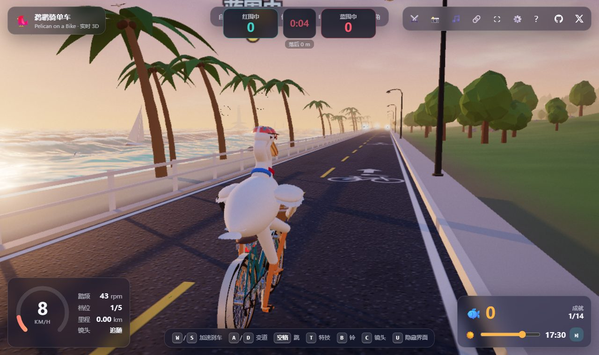

# 鹈鹕骑单车 · Pelican on a Bike（双人在线 PK 版）

一只戴头盔、围红围巾的白鹈鹕，骑着复古单车沿海岸线追鱼。实时 3D：程序化建模、IK 骨骼、布料围巾、Gerstner 海浪、昼夜循环与合成音乐——全程序化生成，无一张外部贴图。

本项目基于 [@riba2534](https://github.com/riba2534) 的开源作品 [claude-opus-5-5-demo](https://github.com/riba2534/claude-opus-5-5-demo) 改造，在其单机体验之上新增**双人在线对战**模式。

## 在线 PK 模式

两名玩家通过房间码或快速匹配进入同一片海岸线，服务器下发完全相同的刷鱼波次，限时比拼夺鱼得分；金鱼掉落干扰技能（逆风 / 海鸥偷分 / 迷雾 / 尾流加速，按 G 释放），车铃与鹈鹕叫声会实时传给对手。平局进入 30 秒金鱼决胜加时。设计详见 [docs/online-pk-design.md](docs/online-pk-design.md)。



## 目录结构

```
├── src/          客户端（Three.js，esbuild 打包为单文件）
│   ├── net/      WebSocket 网络层、对战逻辑（client.js / pk.js）
│   └── ...       鹈鹕/单车/海浪/天空/音效等（原单机模块）
├── server/       Node.js 对战服务器（ws，房间/波次/计分/技能权威）
├── shared/       双端共享协议定义（protocol.mjs）
├── test/         服务器逻辑测试 + playwright 双开 E2E
├── deploy/       nginx 配置（/ws 反代）
├── build.mjs     构建脚本 → dist/index.html
└── deploy.py     一键部署到内网 NAS（SSH+SFTP）
```

## 本地开发

```bash
npm install          # 国内网络可用 --registry=https://registry.npmmirror.com
node build.mjs       # 产出 dist/index.html（单文件，含全部依赖）
node server/index.mjs # 对战服务器，默认 127.0.0.1:8092
node test/server.test.mjs  # 服务器逻辑测试
node test/e2e.mjs           # 双开浏览器 E2E（需 Edge）
```

本地联调：静态页带 `?ws=ws://127.0.0.1:8092` 直连本地服务器；线上走同源 `/ws` 反代。

## 部署（示例：飞牛 NAS / 任意 docker 主机）

```bash
PELICAN_NAS_PASS=xxx python deploy.py   # 构建+上传+起容器一条龙
```

等价的手工部署（nginx 静态 + /ws 反代 + node 容器，同一 docker 网络）：

```nginx
location /ws {
    proxy_pass http://pelican-bike-server:8092;
    proxy_http_version 1.1;
    proxy_set_header Upgrade $http_upgrade;
    proxy_set_header Connection "upgrade";
    proxy_read_timeout 60s;
}
```

## 致谢

- 原始单机版作者：[riba2534](https://github.com/riba2534)
- 引擎：[Three.js](https://threejs.org/) · 参数面板：[lil-gui](https://lil-gui.georgefrancis.dev/)

## License

ISC — 见 [LICENSE](LICENSE)
